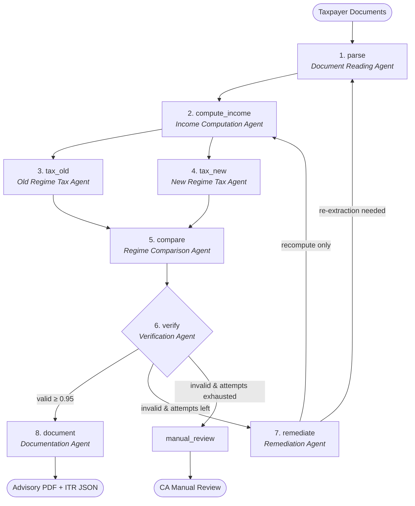

# Self-Healing Multi-Agent Tax Filing System (India)

A **local-first** agentic AI pipeline that turns Indian income tax documents (Form 16 Part A & B, Form 26AS, AIS/TIS, broker capital gains statements, bank interest certificates) into a verified tax filing package with an authoritative **Dual-Regime Comparison Advisory Report** and schema-compliant **ITR JSON** for FY 2025-26 (AY 2026-27).

Eight cooperating agents extract every figure from source documents, compute the five heads of income, run **dual-regime tax engines in parallel** (Old Regime vs. New Regime u/s 115BAC(1A)), compute breakeven and forfeited deductions, challenge results with independent verification gates, execute bounded self-healing remediation, and emit a CA-grade comparison PDF and upload-ready ITR JSON.

The design principle throughout:
> **LLMs read and classify; deterministic code decides and computes.**
>
> Tax math is never authored by a language model. No LLM ever produces a rupee figure that lands on the return. Every slab, threshold, rate, cap, and rebate lives in a versioned Python parameter pack with statutory citations attached.

---

## Architecture

The pipeline is built as a [LangGraph](https://github.com/langchain-ai/langgraph) state machine (`backend/app/workflow/graph.py`) featuring a parallel fan-out for the dual-regime engines and a bounded self-healing loop:



### The 8 Agents

| # | Agent | Node | Responsibility |
|---|---|---|---|
| 1 | **Document Reading Agent** | `parse` | OCR + vision layout parse of Form 16 Part A/B, Form 26AS, AIS/TIS, broker P&L, interest/loan certificates; outputs `IndianTaxpayerData` with per-field evidence and confidence scores. |
| 2 | **Income Computation Agent** | `compute_income` | Deterministic computation across the five heads of income (Salaries with HRA least-of-three, House Property, Presumptive Business 44AD/44ADA/44AE, Capital Gains, Other Sources), intra/inter-head set-off, and Chapter VI-A filtering. |
| 3 | **Old Regime Tax Agent** | `tax_old` | Computes tax under the opt-in Old Regime with age bands (<60, 60-80 senior, 80+ super senior), Chapter VI-A deductions (80C, 80D, 80CCD(1B), 80TTA/TTB, etc.), Section 87A rebate, surcharge, and 4% cess. |
| 4 | **New Regime Tax Agent** | `tax_new` | Computes tax under the statutory default New Regime (Section 115BAC(1A)) with revised slabs, ₹75,000 standard deduction, ₹60,000 rebate up to ₹12 Lakh with marginal relief, and restricted deductions. |
| 5 | **Regime Comparison Agent** | `compare` | Line-by-line delta table, headline rupee savings, bisection-based breakeven deduction calculation, deductions forfeited under new regime, headroom analysis, and switching eligibility (Form 10-IEA). |
| 6 | **Verification Agent** | `verify` | Two independent verdicts (correctness + completeness), engine recomputation, 3-way reconciliation (Form 16 vs 26AS vs AIS/TIS), statutory invariant checks, ITR form eligibility decision tree, and confidence gating (≥0.95). |
| 7 | **Remediation Agent** | `remediate` | Bounded self-healing (maximum 2 attempts); targets specific failed checks with higher-DPI re-extraction or targeted recomputation; logs every change in an immutable audit ledger. |
| 8 | **Documentation Agent** | `document` | Emits the 8-page CA-grade Regime Comparison Advisory PDF, schema-valid ITR JSON for incometax.gov.in, and full audit trail. |

---

## The Core Product: Dual-Regime Comparison

The Indian income tax system requires evaluating identical income facts under two distinct legal frameworks:
1. **New Regime (Section 115BAC(1A))**: Default regime. Wide slabs, ₹75,000 standard deduction, ₹60,000 Section 87A rebate up to ₹12 lakh, virtually no Chapter VI-A deductions.
2. **Old Regime**: Opt-in. Narrower slabs, ₹50,000 standard deduction, extensive Chapter VI-A deductions (80C ₹1.5L, 80CCD(1B) ₹50k, 80D ₹25k/₹50k, 80TTA/TTB, 24(b) home loan interest ₹2L, HRA exemption).

The product calculates both paths deterministically from identical facts and presents:
- Exact rupee savings and recommendation.
- Line-by-line comparison across every income head, deduction, and tax component.
- The **Breakeven Deduction Threshold**: the exact deduction amount above which the Old Regime becomes cheaper.
- Forfeited deductions summary with marginal tax impact.
- Sensitivity analysis for deduction perturbations (-₹50,000 to +₹1,50,000).

---

## Legal & E-Filing Boundary

- **Default Backend (`json_self_file`)**: Generates an official schema-valid ITR JSON for self-upload by the taxpayer on [incometax.gov.in](https://www.incometax.gov.in). No taxpayer credentials are ever requested or stored.
- **Simulation Backend (`mock_eri`)**: Demonstrates the ERI Type-2 API workflow (Login → Add Client → Prefill → Validate & Submit → e-Verify → Acknowledgement).
- **Disclaimer**: See [DISCLAIMER.md](DISCLAIMER.md). Every generated document includes the notice: *"Computer-generated advisory. Not tax advice. Verify with a qualified chartered accountant before filing."*

---

## Getting Started

### Prerequisites
- Python 3.11+
- Node.js 18+ and npm
- Tesseract OCR (for offline document scanning)

### Backend Setup
```bash
cd backend
python -m venv .venv
# On Windows:
.venv\Scripts\activate
# On Linux/macOS:
source .venv/bin/activate

pip install -r requirements.txt
```

### Running Tests
```bash
pytest backend/tests -v
```

### Starting the Application
```bash
# Start backend
cd backend
uvicorn app.main:app --reload --port 8000

# Start frontend
cd ../frontend
npm install
npm run dev
```
