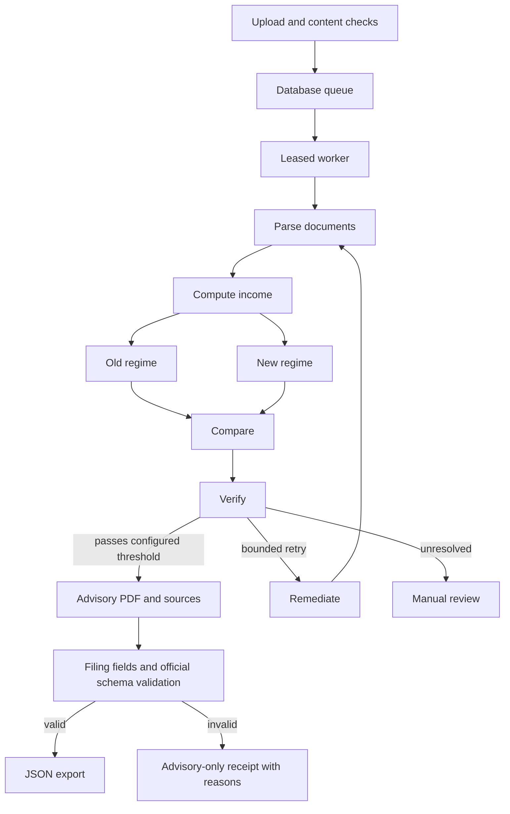

# Architecture

The API validates and stores uploads, then atomically commits a submission and queue job. A separate worker claims a database lease and runs the graph. Jobs retry at most three times; expired leases can be reclaimed after five minutes. A heartbeat renews an active lease every thirty seconds. Cancellation is checked at node boundaries and prevents result publication.

LangGraph checkpoints are stored in SQLite under the shared storage root. A restarted worker resumes an unfinished checkpoint. PostgreSQL stores submission state and queue leases. SQLite checkpoint storage is intended for a local/shared-disk hackathon deployment; a multi-host service needs a network database checkpointer and fencing of external side effects. Retries are at-least-once, not exactly-once.

Tax arithmetic lives in deterministic income and regime calculators. Numeric rule packs select the assessment year and standard non-audit filing deadline. Extensions and special filing categories need explicit rule updates. The FY 2026–27 pack is provisional, not verified.

The documentation stage generates the advisory report independently of filing readiness. Missing identity, unsupported payment schedules, unavailable schemas, corrupt schema checksums or schema violations block export. Official schemas do not yet make the simplified draft builders portal-compatible.

The reading agent uses text/layout parsing and OCR. Optional local vision produces diagnostic hints only. Chroma is not part of the active data path. Audit records are ordinary mutable JSON; there is no immutable external ledger or automated CA certification.

The default verification threshold is 0.97, configured once in backend settings. Frontend download availability follows the backend-provided URLs. Every uploaded PDF/image is appended and each CSV is embedded in the final package.
